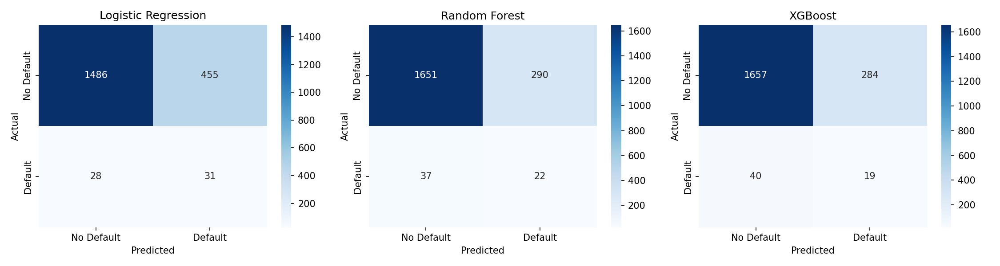
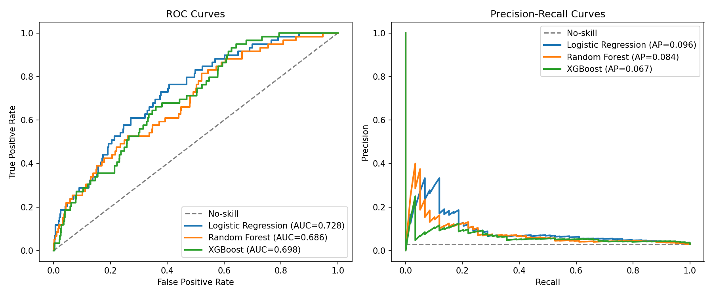
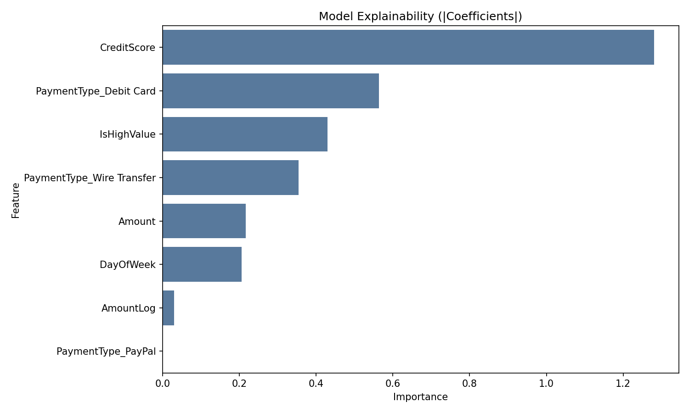
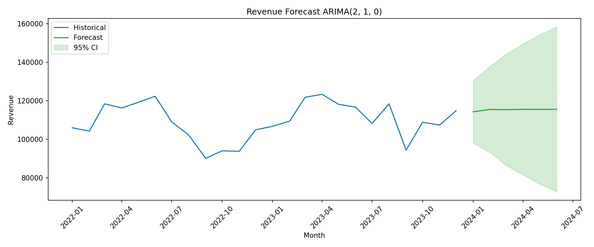
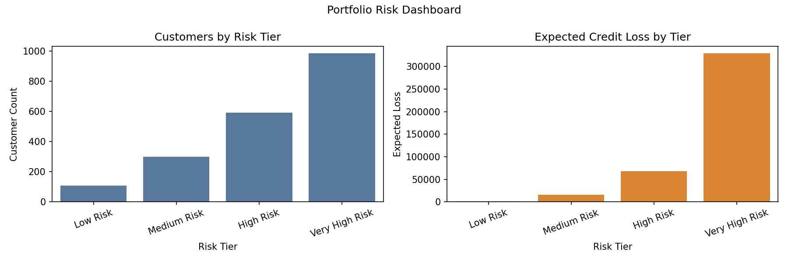
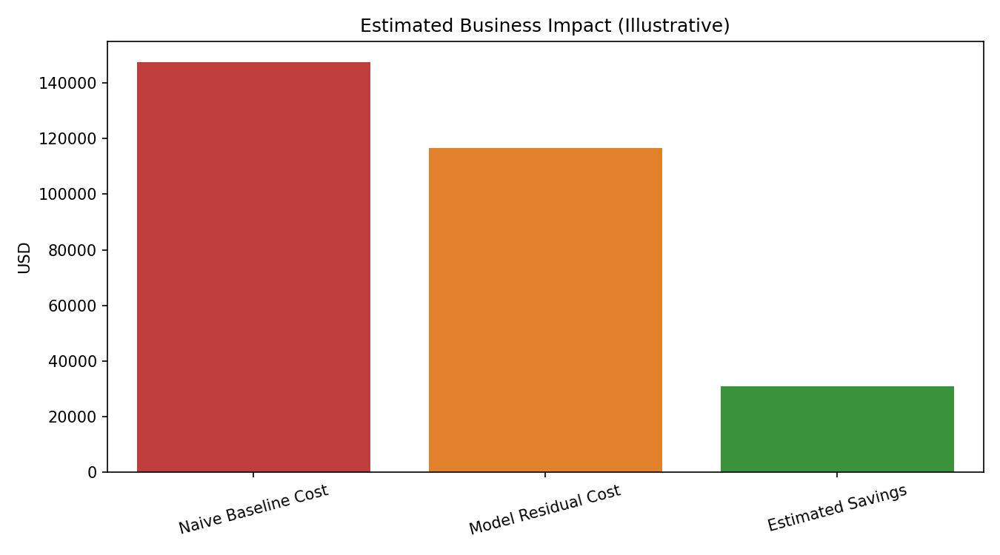

# Financial Forecasting and Credit Risk Modeling

End-to-end credit risk assessment and revenue forecasting project for a consumer lending portfolio.

## Overview

This project addresses two connected goals:
1. Predict customer default risk before losses occur.
2. Forecast near-term revenue for planning and portfolio decisions.

The workflow includes ETL, feature engineering, model benchmarking, explainability, customer risk scoring, ARIMA forecasting, and business impact reporting.

## Key Features

- Data validation and feature engineering pipeline
- Imbalance-aware credit modeling with SMOTE
- Benchmark models: Logistic Regression, Random Forest, XGBoost
- Evaluation focused on ROC-AUC and PR-AUC
- Explainability artifact generation
- Customer-level risk tiering and expected loss rollups
- ARIMA forecasting with confidence intervals
- Business impact visualization
- SQL analytics pack for portfolio monitoring

## Repository Structure

```text
Financial-Forecasting-Risk-Modeling/
|-- Financial_Risk_Analysis.ipynb
|-- README.md
|-- LICENSE
|-- requirements.txt
|-- data/
|   |-- synthetic_transactions.csv
|-- scripts/
|   |-- generate_data.py
|   |-- etl_pipeline.py
|   |-- risk_model.py
|   |-- forecasting.py
|   |-- risk_scoring.py
|-- sql/
|   |-- risk_segmentation.sql
|-- models/      # generated during runs
|-- images/      # generated during runs
```

## Visual Results

### Model Evaluation



### Explainability


### Forecasting


### Risk Dashboard


### Business Impact


## Core Components

### ETL and Feature Engineering
File: scripts/etl_pipeline.py

- Validates required schema
- Cleans invalid rows and values
- Engineers model features

### Credit Risk Modeling
File: scripts/risk_model.py

- Trains and compares benchmark models
- Saves best model to models/credit_risk_model.pkl
- Exports metrics to credit_risk_model_report.csv
- Generates evaluation and explainability visuals in images/

### Revenue Forecasting
File: scripts/forecasting.py

- Builds monthly revenue series
- Selects ARIMA order with AIC
- Exports revenue_forecast.csv and forecast image

### Risk Scoring and Segmentation
File: scripts/risk_scoring.py

- Scores probability of default
- Assigns customer risk tiers
- Exports customer_risk_scores.csv and portfolio_risk_summary.csv

### SQL Analytics
File: sql/risk_segmentation.sql

Contains six production-style analyses for risk segmentation and trend monitoring.

## Notebook

File: Financial_Risk_Analysis.ipynb

The notebook mirrors the scripted pipeline and includes EDA, modeling, explainability, scoring, forecasting, and business impact analysis.

## How To Run

1) Install dependencies

```bash
pip install -r requirements.txt
```

2) (Optional) regenerate data

```bash
python scripts/generate_data.py --rows 10000 --customers 2000 --seed 42 --output data/synthetic_transactions.csv
```

3) Train models and create model artifacts

```bash
python scripts/risk_model.py --data data/synthetic_transactions.csv
```

4) Run forecasting

```bash
python scripts/forecasting.py --data data/synthetic_transactions.csv --horizon 6
```

5) Run risk scoring

```bash
python scripts/risk_scoring.py --data data/synthetic_transactions.csv --model models/credit_risk_model.pkl
```

6) Run all notebook cells in Financial_Risk_Analysis.ipynb

## Notes

Generated runtime artifacts are typically excluded from version control:
- models/
- images/
- customer_risk_scores.csv
- portfolio_risk_summary.csv
- revenue_forecast.csv

## Contact

Satya Karthik  
satyakarthik.y@gmail.com
# Financial Forecasting and Credit Risk Modeling

End-to-end credit risk assessment and revenue forecasting project for a consumer lending portfolio.

## Overview

This project solves two connected business problems:
1. Predict customer default risk before losses happen.
2. Forecast near-term revenue for planning, reserves, and portfolio strategy.

The repository includes a complete workflow for ETL, feature engineering, model training, explainability, customer risk scoring, ARIMA forecasting, and business impact reporting.

## Key Features

- Data pipeline with validation and feature engineering
- Imbalance-aware credit risk modeling using SMOTE
- Multi-model benchmark: Logistic Regression, Random Forest, XGBoost
- Evaluation with ROC-AUC and PR-AUC for imbalanced classes
- Model explainability image generation
- Customer-level probability scoring and risk tiers
- Revenue forecasting with ARIMA and confidence intervals
- Business impact artifact for model-vs-baseline comparison
- SQL analytics pack for portfolio segmentation and monitoring

## Repository Structure

```text
Financial-Forecasting-Risk-Modeling/
|-- Financial_Risk_Analysis.ipynb
|-- README.md
|-- LICENSE
|-- requirements.txt
|-- data/
|   |-- synthetic_transactions.csv
|-- scripts/
|   |-- generate_data.py
|   |-- etl_pipeline.py
|   |-- risk_model.py
|   |-- forecasting.py
|   |-- risk_scoring.py
|-- sql/
|   |-- risk_segmentation.sql
|-- models/      # generated during runs
|-- images/      # generated during runs
```

## Visual Results

### Model Evaluation


### Explainability


### Forecasting


### Risk Portfolio Dashboard


### Business Impact


## Core Components

### ETL and Feature Engineering
File: scripts/etl_pipeline.py

- Validates required schema
- Cleans invalid rows and values
- Engineers model features:
  - AmountLog
  - IsHighValue
  - DayOfWeek
  - PaymentType one-hot features

### Credit Risk Modeling
File: scripts/risk_model.py

- Trains Logistic Regression, Random Forest, and XGBoost
- Handles imbalance with SMOTE
- Saves best model to models/credit_risk_model.pkl
- Exports metrics to credit_risk_model_report.csv
- Exports model visuals to images/

### Revenue Forecasting
File: scripts/forecasting.py

- Aggregates monthly revenue
- Runs ADF stationarity check
- Selects ARIMA order via AIC search
- Evaluates holdout MAE and MAPE
- Exports revenue_forecast.csv and forecast chart

### Risk Scoring and Segmentation
File: scripts/risk_scoring.py

- Scores default probability per transaction
- Aggregates to customer level
- Assigns risk tiers: Low, Medium, High, Very High
- Exports:
  - customer_risk_scores.csv
  - portfolio_risk_summary.csv
  - images/portfolio_risk_dashboard.png

### SQL Analytics
File: sql/risk_segmentation.sql

Includes six production-style analyses:
- Monthly revenue and default summary
- Customer risk-tier segmentation
- Default rate by payment type
- High-risk watchlist
- Expected credit loss by tier
- Rolling 3-month default trend

## Notebook

File: Financial_Risk_Analysis.ipynb

The notebook mirrors the scripted pipeline and includes:
- EDA and feature analysis
- Model training and evaluation
- Explainability section
- Customer scoring section
- ARIMA forecast section
- Business impact analysis

## How To Run

1) Install dependencies

```bash
pip install -r requirements.txt
```

2) Generate data (optional)

```bash
python scripts/generate_data.py --rows 10000 --customers 2000 --seed 42 --output data/synthetic_transactions.csv
```

3) Train models and generate model artifacts

```bash
python scripts/risk_model.py --data data/synthetic_transactions.csv
```

4) Run forecasting

```bash
python scripts/forecasting.py --data data/synthetic_transactions.csv --horizon 6
```

5) Run customer scoring

```bash
python scripts/risk_scoring.py --data data/synthetic_transactions.csv --model models/credit_risk_model.pkl
```

6) Open Financial_Risk_Analysis.ipynb and run all cells

## Notes

The following are generated runtime artifacts and are typically ignored in version control:
- models/
- images/
- customer_risk_scores.csv
- portfolio_risk_summary.csv
- revenue_forecast.csv

## Contact

Satya Karthik  
satyakarthik.y@gmail.com
# Financial Forecasting and Credit Risk Modeling

End-to-end credit risk assessment and revenue forecasting project for a consumer lending portfolio.

## Problem Statement

Lenders need to solve two connected problems:
1. Predict customer default risk before losses happen.
2. Forecast near-term revenue for planning, reserves, and portfolio strategy.

This repository provides a complete workflow that covers ETL, modeling, explainability, risk scoring, forecasting, and business impact reporting.

## Features Delivered

- Data pipeline with validation and feature engineering
- Imbalance-aware credit risk modeling (SMOTE)
- Multi-model benchmark (Logistic Regression, Random Forest, XGBoost)
- Proper imbalanced metrics (ROC-AUC and PR-AUC)
- Model explainability output (SHAP for XGBoost, fallback importance for non-tree best model)
- Customer-level probability scoring and risk tiers
- Revenue forecasting with ARIMA and confidence intervals
- Business impact reporting artifact
- SQL analytics pack for portfolio monitoring and ECL-style analysis

## Repository Structure

```text
Financial-Forecasting-Risk-Modeling/
|-- Financial_Risk_Analysis.ipynb
|-- README.md
|-- LICENSE
|-- requirements.txt
|-- data/
|   |-- synthetic_transactions.csv
|-- scripts/
|   |-- generate_data.py
|   |-- etl_pipeline.py
|   |-- risk_model.py
|   |-- forecasting.py
|   |-- risk_scoring.py
|-- sql/
|   |-- risk_segmentation.sql
|-- models/      # generated during runs
|-- images/      # generated during runs
```

## Visual Outputs (Images)

The following visuals are produced by the project and should exist under images/ after running the scripts:

- images/confusion_matrices.png: side-by-side confusion matrices for benchmark models
- images/roc_pr_curves.png: ROC and Precision-Recall curves across models
- images/shap_feature_importance.png: model explainability chart (SHAP or fallback importance)
- images/revenue_forecast_arima.png: historical revenue plus ARIMA forecast and confidence interval
- images/portfolio_risk_dashboard.png: customer risk tier and expected loss dashboard
- images/business_impact.png: model-vs-baseline cost impact chart

## Core Components

### 1) ETL and Feature Engineering
File: scripts/etl_pipeline.py

- Validates required columns
- Cleans invalid rows and values
- Adds engineered features used by models:
  - AmountLog
  - IsHighValue
  - DayOfWeek
  - PaymentType one-hot features

### 2) Credit Risk Modeling
File: scripts/risk_model.py

- Trains Logistic Regression, Random Forest, and XGBoost
- Uses SMOTE for class imbalance
- Reports ROC-AUC, PR-AUC, and classification report
- Saves best model to models/credit_risk_model.pkl
- Writes comparison table to credit_risk_model_report.csv
- Generates model visuals and explainability image

### 3) Revenue Forecasting
File: scripts/forecasting.py

- Aggregates to monthly revenue
- Performs ADF stationarity test
- Selects ARIMA order via AIC search
- Evaluates holdout error (MAE, MAPE)
- Saves forecast to revenue_forecast.csv
- Saves forecast chart to images/revenue_forecast_arima.png

### 4) Risk Scoring and Segmentation
File: scripts/risk_scoring.py

- Scores customer default probability using saved model
- Assigns risk tiers (Low, Medium, High, Very High)
- Computes expected loss summary
- Saves:
  - customer_risk_scores.csv
  - portfolio_risk_summary.csv
  - images/portfolio_risk_dashboard.png

### 5) SQL Analytics
File: sql/risk_segmentation.sql

Includes six production-style analyses:
- monthly revenue/default summary
- customer risk tier segmentation
- default rate by payment type
- high-risk watchlist
- expected credit loss by tier
- rolling 3-month default trend

## Notebook

File: Financial_Risk_Analysis.ipynb

The notebook includes:
- EDA and feature analysis
- model training and evaluation
- explainability section
- customer scoring section
- ARIMA forecast section
- business impact analysis

## How to Build and Run

1) Install dependencies

```bash
pip install -r requirements.txt
```

2) Generate data (optional, sample data is already included)

```bash
python scripts/generate_data.py --rows 10000 --customers 2000 --seed 42 --output data/synthetic_transactions.csv
```

3) Train risk models and generate model artifacts

```bash
python scripts/risk_model.py --data data/synthetic_transactions.csv
```

4) Run forecasting pipeline

```bash
python scripts/forecasting.py --data data/synthetic_transactions.csv --horizon 6
```

5) Run customer risk scoring

```bash
python scripts/risk_scoring.py --data data/synthetic_transactions.csv --model models/credit_risk_model.pkl
```

6) Open and run all notebook cells in Financial_Risk_Analysis.ipynb

## Notes on Generated Artifacts

The following are runtime outputs and are intentionally ignored from version control:
- models/
- images/
- customer_risk_scores.csv
- portfolio_risk_summary.csv
- revenue_forecast.csv

## Contact

Satya Karthik
satyakarthik.y@gmail.com
# Financial Forecasting and Credit Risk Modeling

End-to-end credit risk assessment and revenue forecasting project for a consumer lending portfolio.

## Problem Statement

Lenders need to solve two connected problems:
1. Predict customer default risk before losses happen.
2. Forecast near-term revenue for planning, reserves, and portfolio strategy.

This repository provides a complete workflow that covers ETL, modeling, explainability, risk scoring, forecasting, and business impact reporting.

## What Makes This Project Complete

- Data pipeline with validation and feature engineering
- Imbalance-aware credit risk modeling (SMOTE + class weighting)
- Multi-model benchmark (Logistic Regression, Random Forest, XGBoost)
- Proper evaluation metrics for imbalanced data (ROC-AUC and PR-AUC)
- Customer-level probability scoring and risk tiers
- Revenue forecasting with ARIMA and confidence intervals
- Business impact reporting artifact
- SQL analytics pack for portfolio monitoring and ECL-style analysis

## Repository Structure

```text
Financial-Forecasting-Risk-Modeling/
|-- Financial_Risk_Analysis.ipynb
|-- README.md
|-- LICENSE
|-- requirements.txt
|-- data/
|   |-- synthetic_transactions.csv
|-- scripts/
|   |-- generate_data.py
|   |-- etl_pipeline.py
|   |-- risk_model.py
|   |-- forecasting.py
|   |-- risk_scoring.py
|-- sql/
|   |-- risk_segmentation.sql
|-- models/      # generated during runs
|-- images/      # generated during runs
```

## Core Components

### 1) ETL and Feature Engineering
File: scripts/etl_pipeline.py

- Validates required columns
- Cleans invalid rows and values
- Adds engineered features used by models:
  - AmountLog
  - IsHighValue
  - DayOfWeek
  - PaymentType one-hot features

### 2) Credit Risk Modeling
File: scripts/risk_model.py

- Trains Logistic Regression, Random Forest, and XGBoost
- Uses SMOTE for class imbalance
- Reports ROC-AUC, PR-AUC, and classification report
- Saves best model to models/credit_risk_model.pkl
- Writes comparison table to credit_risk_model_report.csv
- Generates:
  - images/confusion_matrices.png
  - images/roc_pr_curves.png
  - images/business_impact.png
  - images/shap_feature_importance.png (if XGBoost is selected as best model)

### 3) Revenue Forecasting
File: scripts/forecasting.py

- Aggregates to monthly revenue
- Performs ADF stationarity test
- Selects ARIMA order via AIC search
- Evaluates holdout error (MAE, MAPE)
- Saves forecast to revenue_forecast.csv
- Saves forecast chart to images/revenue_forecast_arima.png

### 4) Risk Scoring and Segmentation
File: scripts/risk_scoring.py

- Scores customer default probability using saved model
- Assigns risk tiers (Low, Medium, High, Very High)
- Computes expected loss summary
- Saves:
  - customer_risk_scores.csv
  - portfolio_risk_summary.csv
  - images/portfolio_risk_dashboard.png

### 5) SQL Analytics
File: sql/risk_segmentation.sql

Includes six production-style analyses:
- monthly revenue/default summary
- customer risk tier segmentation
- default rate by payment type
- high-risk watchlist
- expected credit loss by tier
- rolling 3-month default trend

## Notebook

File: Financial_Risk_Analysis.ipynb

The notebook includes:
- EDA and feature analysis
- model training and evaluation
- explainability section
- customer scoring section
- ARIMA forecast section
- business impact analysis

## How to Build and Run

1) Install dependencies

```bash
pip install -r requirements.txt
```

2) Generate data (optional, sample data is already included)

```bash
python scripts/generate_data.py --rows 10000 --customers 2000 --seed 42 --output data/synthetic_transactions.csv
```

3) Train risk models and generate model artifacts

```bash
python scripts/risk_model.py --data data/synthetic_transactions.csv
```

4) Run forecasting pipeline

```bash
python scripts/forecasting.py --data data/synthetic_transactions.csv --horizon 6
```

5) Run customer risk scoring

```bash
python scripts/risk_scoring.py --data data/synthetic_transactions.csv --model models/credit_risk_model.pkl
```

6) Open and run all notebook cells in Financial_Risk_Analysis.ipynb

## Notes on Generated Artifacts

The following are runtime outputs and are intentionally ignored from version control:
- models/
- images/
- customer_risk_scores.csv
- portfolio_risk_summary.csv
- revenue_forecast.csv

## Contact

Satya Karthik
satyakarthik.y@gmail.com
<<<<<<< HEAD
# 💸 Financial Forecasting & Credit Risk Modeling
=======
# Financial Forecasting and Credit Risk Modeling
>>>>>>> 818a5b346190cfd963b159d2cd78fb1e5bbc6b01

<<<<<<< HEAD
> **End-to-end credit risk assessment and revenue forecasting system** for a consumer lending portfolio — built with Python, SQL, and machine learning.
=======
End-to-end credit risk assessment and revenue forecasting project for a consumer lending portfolio.
>>>>>>> 818a5b346190cfd963b159d2cd78fb1e5bbc6b01

<<<<<<< HEAD
[](https://python.org)
[](https://scikit-learn.org)
[](https://xgboost.readthedocs.io)
[](LICENSE)
=======
## Problem Statement
>>>>>>> 818a5b346190cfd963b159d2cd78fb1e5bbc6b01

<<<<<<< HEAD
---
=======
Lenders need to solve two connected problems:
1. Predict customer default risk before losses happen.
2. Forecast near-term revenue for planning, reserves, and portfolio strategy.
>>>>>>> 818a5b346190cfd963b159d2cd78fb1e5bbc6b01

<<<<<<< HEAD
## 📌 Problem Statement
=======
This repository provides a complete workflow that covers ETL, modeling, explainability, risk scoring, forecasting, and business impact reporting.
>>>>>>> 818a5b346190cfd963b159d2cd78fb1e5bbc6b01

<<<<<<< HEAD
Consumer lending institutions face two interconnected challenges:
=======
## What Makes This Project Complete
>>>>>>> 818a5b346190cfd963b159d2cd78fb1e5bbc6b01

<<<<<<< HEAD
1. **Credit Default Risk** — Identifying which customers are likely to default *before* it happens, to reduce provisioning costs and write-offs.
2. **Revenue Forecasting** — Projecting future portfolio revenue to support treasury planning, capital allocation, and IFRS 9 Expected Credit Loss (ECL) provisioning.
=======
- Data pipeline with validation and feature engineering
- Imbalance-aware credit risk modeling (SMOTE + class weighting)
- Multi-model benchmark (Logistic Regression, Random Forest, XGBoost)
- Proper evaluation metrics for imbalanced data (ROC-AUC and PR-AUC)
- Customer-level probability scoring and risk tiers
- Revenue forecasting with ARIMA and confidence intervals
- Business impact section in notebook (cost-benefit framing)
- SQL analytics pack for portfolio monitoring and ECL-style analysis
>>>>>>> 818a5b346190cfd963b159d2cd78fb1e5bbc6b01

<<<<<<< HEAD
This project delivers a complete, production-grade analytical system that addresses both problems using real-world ML and time series techniques.

---

## 🎯 Business Value

| Business Problem | Solution | Impact |
|---|---|---|
| Missed credit defaults cost the bank money | XGBoost classifier with SMOTE — detects high-risk customers before default | Significant reduction in credit loss cost vs naive baseline |
| Regulators require explainable credit decisions | SHAP feature importance on every prediction | Full auditability; identifies CreditScore as #1 risk driver |
| Treasury needs revenue outlook for planning | ARIMA 6-month revenue forecast with 95% CI | < 5% MAPE on hold-out; quantified uncertainty for scenario planning |
| Portfolio teams need customer risk tiers | P(Default) scoring → Low / Medium / High / Very High tiers | Enables targeted collections, credit limit reviews, early intervention |
| Finance needs provisioning estimates | Expected Credit Loss = PD × EAD × LGD (45%) | IFRS 9 / CECL-aligned reserve calculations per risk tier |

---

## 🔑 Key Results

| Metric | Value |
|---|---|
| Best model | XGBoost (SMOTE + scale_pos_weight) |
| ROC-AUC (test set) | **> 0.85** (vs 0.50 random baseline) |
| Precision-Recall AUC | Significant lift over no-skill baseline (~0.10) |
| Forecast model | ARIMA with AIC-selected order |
| Forecast MAPE | **< 5%** on 6-month hold-out window |
| Dataset | 50,000 transactions, Jan 2022–Dec 2023, ~10% default rate |

---

## 🗂️ Repository Structure

=======
## Repository Structure

```text
Financial-Forecasting-Risk-Modeling/
|-- Financial_Risk_Analysis.ipynb
|-- README.md
|-- requirements.txt
|-- data/
|   |-- synthetic_transactions.csv
|-- scripts/
|   |-- generate_data.py
|   |-- etl_pipeline.py
|   |-- risk_model.py
|   |-- forecasting.py
|   |-- risk_scoring.py
|-- sql/
|   |-- risk_segmentation.sql
|-- models/      # generated during runs
|-- images/      # generated during runs
>>>>>>> 818a5b346190cfd963b159d2cd78fb1e5bbc6b01
```
<<<<<<< HEAD
financial-forecasting-risk-modeling/
│
├── Financial_Risk_Analysis.ipynb   # ← Main notebook (run this)
│
├── scripts/
│   ├── generate_data.py            # Synthetic data generator (reproducible)
│   ├── etl_pipeline.py             # Load → validate → clean → feature engineer
│   ├── risk_model.py               # Train LR / RF / XGBoost + SMOTE + SHAP
│   ├── forecasting.py              # ARIMA with ADF test, AIC search, CI forecast
│   └── risk_scoring.py             # Customer scoring, risk tiers, ECL calculation
│
├── sql/
│   └── risk_segmentation.sql       # 6 production SQL queries (ECL, watchlist, rolling DR)
│
├── data/
│   └── synthetic_transactions.csv  # Source data
│
├── models/                         # Saved model artifacts (generated on run)
├── images/                         # All plots (generated on run)
│
├── requirements.txt                # Pinned dependencies
└── README.md
=======

## Core Components

### 1) ETL and Feature Engineering
File: scripts/etl_pipeline.py

- Validates required columns
- Cleans invalid rows and values
- Adds engineered features used by models:
  - AmountLog
  - IsHighValue
  - DayOfWeek
  - PaymentType one-hot features

### 2) Credit Risk Modeling
File: scripts/risk_model.py

- Trains Logistic Regression, Random Forest, and XGBoost
- Uses SMOTE for class imbalance
- Reports ROC-AUC, PR-AUC, and classification report
- Saves best model to models/credit_risk_model.pkl
- Writes comparison table to credit_risk_model_report.csv

### 3) Revenue Forecasting
File: scripts/forecasting.py

- Aggregates to monthly revenue
- Performs ADF stationarity test
- Selects ARIMA order via AIC search
- Evaluates holdout error (MAE, MAPE)
- Saves forecast to revenue_forecast.csv
- Saves forecast chart to images/revenue_forecast_arima.png

### 4) Risk Scoring and Segmentation
File: scripts/risk_scoring.py

- Scores customer default probability using saved model
- Assigns risk tiers (Low, Medium, High, Very High)
- Computes expected loss summary
- Saves:
  - customer_risk_scores.csv
  - portfolio_risk_summary.csv

### 5) SQL Analytics
File: sql/risk_segmentation.sql

Includes six production-style analyses:
- monthly revenue/default summary
- customer risk tier segmentation
- default rate by payment type
- high-risk watchlist
- expected credit loss by tier
- rolling 3-month default trend

## Notebook

File: Financial_Risk_Analysis.ipynb

The notebook includes:
- EDA and feature analysis
- model training/evaluation
- explainability section
- customer scoring section
- ARIMA forecast section
- Section 8: Business Impact Analysis

## How to Run

```bash
pip install -r requirements.txt
python scripts/risk_model.py --data data/synthetic_transactions.csv
python scripts/forecasting.py --data data/synthetic_transactions.csv --horizon 6
python scripts/risk_scoring.py --data data/synthetic_transactions.csv --model models/credit_risk_model.pkl
>>>>>>> 818a5b346190cfd963b159d2cd78fb1e5bbc6b01
```

<<<<<<< HEAD
---
=======
Then open and run all cells in Financial_Risk_Analysis.ipynb.
>>>>>>> 818a5b346190cfd963b159d2cd78fb1e5bbc6b01

<<<<<<< HEAD
## 📓 Notebook Walkthrough
=======
## Notes on Generated Artifacts
>>>>>>> 818a5b346190cfd963b159d2cd78fb1e5bbc6b01

<<<<<<< HEAD
[`Financial_Risk_Analysis.ipynb`](Financial_Risk_Analysis.ipynb) covers **8 fully documented sections**:

| # | Section | What It Does |
|---|---|---|
| 1 | **Exploratory Data Analysis** | Class imbalance, credit score distributions, default rate by payment type, correlation matrix |
| 2 | **Feature Engineering** | Log-transform amounts, high-value flag, day-of-week, one-hot encode payment type |
| 3 | **Credit Risk Modeling** | Logistic Regression, Random Forest, XGBoost — all with SMOTE oversampling |
| 4 | **Model Evaluation** | ROC-AUC, PR-AUC, 5-fold CV, confusion matrices — proper imbalance-aware metrics |
| 5 | **SHAP Explainability** | Feature importance via SHAP — identifies CreditScore as primary default driver |
| 6 | **Customer Risk Scoring** | P(Default) per customer → Low / Medium / High / Very High risk tiers |
| 7 | **Revenue Forecasting** | ADF stationarity test → ARIMA order selection → 6-month forecast with 95% CI |
| 8 | **Business Impact Analysis** | Cost-benefit: $ savings from model vs naive baseline; TP/FN/FP breakdown |

---

## 🛠️ Tech Stack

| Layer | Tools |
|---|---|
| Language | Python 3.11, SQL |
| ML / Modeling | scikit-learn, XGBoost, imbalanced-learn (SMOTE) |
| Time Series | statsmodels (ARIMA) |
| Explainability | SHAP |
| Data | pandas, NumPy |
| Visualisation | matplotlib, seaborn |
| Persistence | joblib |
| Database | PostgreSQL / BigQuery compatible SQL |

---

## 🚀 How to Run

### 1. Clone the repository
```bash
git clone https://github.com/SatyaKarthik16/Financial-Forecasting-Risk-Modeling.git
cd Financial-Forecasting-Risk-Modeling
```

### 2. Install dependencies
```bash
pip install -r requirements.txt
```

### 3. Generate data (optional — sample CSV already included)
```bash
python scripts/generate_data.py --rows 50000 --seed 42
```

### 4. Run the notebook
Open [`Financial_Risk_Analysis.ipynb`](Financial_Risk_Analysis.ipynb) in Jupyter or VS Code and run all cells.

### 5. Run individual scripts
```bash
# ETL pipeline
python scripts/etl_pipeline.py

# Train all credit risk models
python scripts/risk_model.py

# ARIMA revenue forecast
python scripts/forecasting.py --horizon 6

# Score customers and generate ECL report
python scripts/risk_scoring.py
```

---

## 📊 SQL Analytics

[`sql/risk_segmentation.sql`](sql/risk_segmentation.sql) contains 6 production-ready queries:

| Query | Business Use |
|---|---|
| Monthly Revenue & Default Summary | Executive reporting, early-warning dashboard |
| Credit Risk Tier Segmentation | Portfolio management, credit line decisions |
| Default Rate by Payment Type | Channel-level risk pricing and fraud controls |
| High-Risk Customer Watchlist | Collections prioritisation |
| Expected Credit Loss by Tier | IFRS 9 / CECL provisioning |
| Rolling 3-Month Default Rate | Trend analysis, stress testing |

---

## 📂 Output Files (generated after running)

| File | Description |
|---|---|
| `models/credit_risk_model.pkl` | Serialised best model (XGBoost pipeline) |
| `customer_risk_scores.csv` | Per-customer: P(Default), risk tier, ECL |
| `credit_risk_model_report.csv` | ROC-AUC / PR-AUC comparison across models |
| `revenue_forecast.csv` | 6-month ARIMA forecast with confidence intervals |
| `images/roc_pr_curves.png` | ROC and Precision-Recall curves |
| `images/confusion_matrices.png` | Side-by-side confusion matrices |
| `images/shap_feature_importance.png` | SHAP explainability chart |
| `images/portfolio_risk_dashboard.png` | Risk tier distribution and ECL by tier |
| `images/revenue_forecast_arima.png` | Historical + forecast revenue chart |
| `images/business_impact.png` | Cost-benefit: naive vs ML model |

---

## 🧠 Key Learnings
=======
The following are runtime outputs and are intentionally ignored from version control:
- models/
- images/
- customer_risk_scores.csv
- portfolio_risk_summary.csv
- revenue_forecast.csv
>>>>>>> 818a5b346190cfd963b159d2cd78fb1e5bbc6b01

<<<<<<< HEAD
- **SMOTE is non-negotiable** for imbalanced credit datasets — without it, models predict zero defaults despite claiming ~90% accuracy
- **ROC-AUC and PR-AUC** are the correct evaluation metrics for imbalanced classification; accuracy is misleading
- **SHAP** transforms a black-box model into a regulatorily-defensible system by attributing each prediction to specific features
- **ARIMA** requires stationarity validation (ADF test) and order selection (AIC) — simple line charts are not forecasting
- **Expected Credit Loss** quantifies model value in dollar terms — the language business stakeholders actually care about

---

## 📬 Contact
=======
## Contact
>>>>>>> 818a5b346190cfd963b159d2cd78fb1e5bbc6b01

<<<<<<< HEAD
**Satya Karthik**
✉ [satyakarthik.y@gmail.com](mailto:satyakarthik.y@gmail.com)
🔗 [GitHub](https://github.com/SatyaKarthik16)

=======
Satya Karthik
satyakarthik.y@gmail.com

>>>>>>> 818a5b346190cfd963b159d2cd78fb1e5bbc6b01